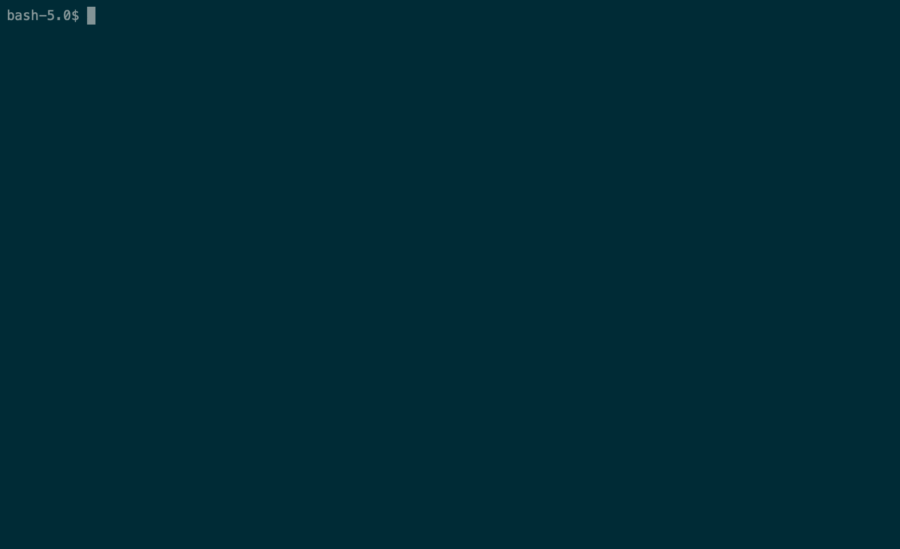

# FairDEx
Practical Exchange for Unique Digital Goods

This repository contains a research prototype and evaluation dataset of FairDEx protocol described in "Practical Exchange for Unique Digital Goods" to appear at the 3rd IEEE International Conference on Decentralized Applications and Infrastructures (IEEE DAPPS 2021).

## Getting Started

### Prerequisites
1. Client applications require `web3.py` for blockchain interaction. Install it via `pip install web3`.
2. The prototype uses Infura API to connect Ethereum network. Get a free API key at [https://infura.io](https://infura.io).
3. To deploy the contract you can use MetaMask wallet installed in your browser. MetaMask is available at [https://metamask.io/](https://metamask.io).

### Installation
1. Clone git repository
`git clone https://github.com/ziyagenc/fairdex.git`
2. Deploy FairDEx smart contract on Ropsten network. Go to [remix.ethereum.org](remix.ethereum.org) and open [fairdex.sol](fairdex.sol) in Remix IDE. Next, compile the source and deploy the contract.
3. Edit conf files. Open [sender.conf](sender.conf) and [receiver.conf](receiver.conf) in a text editor and enter required information like Infura URL and contract address.

### Usage
1. Fill the fields in [sender.conf](sender.conf) and [receiver.conf](receiver.conf) files.
2. Run sender application `python sender.py`.
3. This will produce a file called `offchain.txt`. Make sure that this file is in the same folder with `receiver.py`.
4. Run receiver application `python receiver.py`.
5. Follow the instructions on the terminal.

Sender                                |  Receiver
:------------------------------------:|:----------------------------------------:
  |  
 
### Dataset
[evaluation-dataset.xlsx](evaluation-dataset.xlsx) reports the measurements of costs for deploying and running FairDEx. In addition, this file contains the contract addresses used in our experiments.
